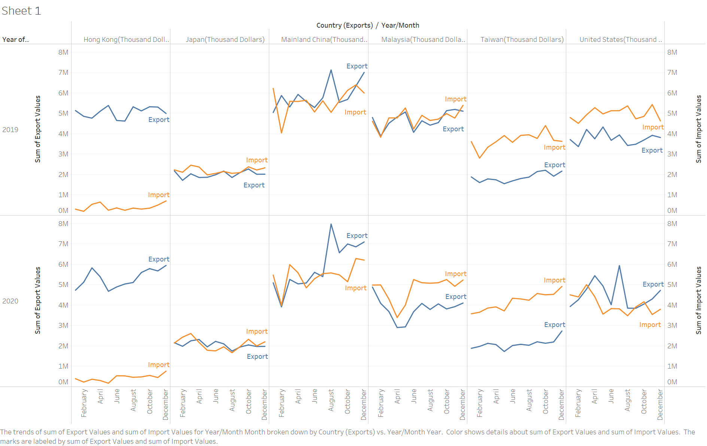

```{r setup, include=FALSE}
knitr::opts_chunk$set(echo = FALSE)
```

# 1.0 Crtique of Original Data Visualization


The above data visualization is created using the datasets downloaded from the sub-section of [**Merchandise Trade by Region/Market**](https://www.singstat.gov.sg/find-data/search-by-theme/trade-and-investment/merchandise-trade/latest-data) provided by the Department of Statistic, Singapore (DOS). 

### 1.1 Clarity
1. **Overlapping density plots** might confuse the reader into thinking that there are three different components being measured.

2. The Dual-axis density plots are **not synchronised** resulting in two  different scales being measured. This will provide false information to the reader into thinking that one measured component is higher/lower than the other. 

3. Each country **y-axis(Export/Import) has different scale** which make it difficult for readers to compare. E.g. Japan in reality has lower overall merchandise trade than Mainland China. However, the above chart seems to show both having almost the same trade value.

4. The year of interest should be from 2019-2020 based on the title given. However, there are charts that **extend to 2021** and also charts with **missing years** such as Japan.

5. There is no annotations or labeling available to indicate important values and information derived from the chart.

6. There is **no sub-title/caption** to share any insights retrieved from the graph. The sub-title will play a part in allowing the reader the important takeaway from the chart.

### 1.2 Aesthetic
1. As this is a time-series data, it will be better **to arrange the chart into quarter or months** at the x-axis instead of just years to have a more accurate representation of the value. Additionally, it will be easier to **identify the start to the end of the year** by using quarter or month to represent each year.

2. The usage of density plots **covers the tick marks** that represented the y-axis. This might prevent the user from easily referencing a point to a value. 

3. **Title is too small**. It should be big and in clear black font to show the title of the visualization clearly.

4. **The x-axis scale of each country are different.** E.g., Mainland China and Malaysia has a wider x-axis scale while HK, Taiwan and US have a narrower scale. This does not give an accurate representation and comparison between the countries. It shows that there is sharper increase/decrease in value in countries that has narrower scale than those that are of wider scale.

5. US should be renamed to United States to show its full name. This is to **have consistency** with the rest of the countries. For example, Hong Kong is not labeled by its acronym H.K.


# 2.0 Proposed data visualisation design


The above proposed design incorporated a line chart separated between the six countries and both years for a clearer and cleaner view of the chart.

### 2.1 Clarity
1. Like the original design, both export and import are in the same pane differentiated by country and year. However, instead of using a overlapping density plot, a **line chart is used which reduces unnecessary data-ink**. This proposed design is **very clean and clear** as there is no overlap in the chart.  Readers will be able to read the chart without any confusion.

2. Like the original design, the proposed design uses the dual axis too. However, both import and export scales are **synchronized**, and the right scale has been hidden to enlarge the visualization for better viewing. As such, the chart would not look skewed. Readers will be able to compare both import and export of a country in the same pane. At the same time, readers can compare with other countries easily.

3. The y-axis scale is the same throughout the whole chart.

4. As stated in the title, the year of interest is 2019-2020. The chart has been split into 2019 and 2020 too for readers to easily examine all six countries across the same year and reference upwards or downwards to the other year.

5. Annotations and labeling will be provided to highlight important information derived from the chart.

6. Sub-title/ Caption will be available to clearly show the important takeaways derived from the chart.

### 2.2 Aesthetic
1. The x-axis is represented by month. The line chart will also be **accompanied with dots** to allow user to easily reference the point from a particular month to a value.

2. With the usage of line charts, the tick-marks are more easily visible for better referencing.

3. The title is big and clear to allow readers to understand the intent of the chart.

4. The x-axis represented by month has the **same scale** (relative lengths) throughout the chart, this will provide accuracy and not skewed charts. As such, readers will not be deceive into thinking that a particular chart has a steeper rate of change in value due to it being skewed. 

5. US will be changed to United States to show consistency with the names of the other five countries.

6. Each line graph is **directly labeled** to allow user user to know the identity of its line instead of the need to reference to a legend.

# 3.0 Data Visualisation

The completed data visualization using tableau desktop can be accessed through [**here**](https://public.tableau.com/app/profile/chee.hong/viz/SingaporeMerchandiseTrade/Dashboard1)

# 4.0 Step-by-step data visualisation process

### 4.1 Data Preparation

1. Download and open the excel file downloaded from the sub-section of [**Merchandise Trade by Region/Market**](https://www.singstat.gov.sg/find-data/search-by-theme/trade-and-investment/merchandise-trade/latest-data) provided by the Department of Statistic, Singapore (DOS). The original excel file is as shown below with two major sheets “T1” and “T2” subsequently renamed to “Imports” and “Exports.”


2. Move the Variables and Year/Month columns to the first row.


3. Open Tableau Prep Builder and connect to the excel file. Drag the exports sheet to the working diagram and select out the variables of interest. 


4. Next, **keep only** the 6 countries of interest in the cleaning step and check for any missing data.


5. After checking the final dataset, modify the dataset to make it into three columns namely **Country (Exports)**, **Month/Year** and **Export Values** by the method of **pivoting**. Repeat step 4.1.3 to 4.1.5 with Import’s sheet.


6. The final prepared process will look like this below. We will next export out the prepared datasets to excel.


### 4.2 Data Visualisation 

1. Connect tableau with the cleaned datasets. Link both Exports and Imports data via Country and Year/Month. Change the 3 columns for both dataset to their appropriate datatype. 


2. Next we will begin to create the chart. With the same design in mind, The country and month will be input as columns while the Year, Sum(Export values) and Sum(Import values) will be input as rows. Below is the result.


3. To positioned both Imports and Exports in the same pane for better comparison and visualisation. A dual axis will be performed on SUM (Export Values) and SUM (Import Values).  Both axes will thereafter be synchronized to provide an accurate representation of the data. 


4. Next the measured names will be removed and fixed each line with a label directly. The label is coloured to show distinction between the two measured values. This will also widen the chart for better viewing and also allow the user to understand the representation of each line directly.



5. To further widen the whole chart, the “Sum of Import Values” scale will be hidden and the “Sum of Export Values” will be renamed to “Import/Export Values $(‘000)”. Additionally, changes were made to the countries on the x-axis to remove the (Thousand Dollars) and renamed the Year/Month to Month and Country (Exports) to Countries to better represent the x-axis.


6. Next, dots were shown on the line chart to better relate the value with each year/month.


7. Next, the highest trade value will be highlighted to exhibit the highest value. The following code will be used to highlight the value. The highest point will then be highlighted in red.


8. Afterwhich, the newly created "Highest Export Value" will be dragged to colours to provide distinction between the Highest Value and the rest of the chart for both years.


9. Next, the highest trade value will be labelled. As the labeling has been done before for Export and Import. We could not do another labeling for the max value. As such, the sheet will be transited to dashboard to physically label as text. Additionally, a dotted line has been included to highlight the month of interest. 

9(a) Of note, a duplicate of the export values using 'circle' chart and thereafter dual-axis can solve the problem of labeling the highest value. However, dual-axis has already been utilized in this chart.


10. Next, an annotation will be included on the highest trade value to indicate that both highest trade value happen on August of both years with Mainland China. The annotation has been formatted to show borders for better visibility.


11. Next, we will create annotation for the month of January 2020 to April 2020 for the trades with Malaysia to show that there is a steep decrease in trade value. Annotation is also included to indicate the steep decrease in trade values.

11(a) Of note, a reason for the decrease in trades between Singapore and Malaysia might be due to the border closure caused by Covid-19. To avoid, the **Storytelling bug** as part of the **Three Bugs of Chart Interpretation**, the possible reason will not be included in the annotation.


12. Next, we will highlight the gradual increase of Singapore trade with Taiwan for the year of 2020. The reason for this annotation is to show that Taiwan is the only country that seemingly having a gradual increase in trades with Singapore as compared to the other five countries.


13. Next, we will include the title and sub-title/caption. Additionally, the tooltip will also be removed to minimize any interactivity present in the charts.


14. Finally, we will do some minor tweaks by 1) removing the countries/month 2) correct the symbol and enlarge the font of the highest trade value and 3) minimise the y-axis to further widen the chart. Additionally, the source and dataset will be added. Thereafter, the visualisation is completed.


15. The visualisation can be assessed from this [**link**](https://public.tableau.com/app/profile/chee.hong/viz/SingaporeMerchandiseTrade/Dashboard1). Do note that there will be some minor differences between the visualisation from Tableau Desktop and Tableau Public due to difference in screen size etc.

# 5.0 Observations from the data visualisation

### 5.1 Three Major Observations

1. Singapore 's import from Hong Kong is **way lower than its export** as compared to other countries.

2. The **highest trade value** of around S$7B in 2019 and around S$8B in 2020 is **during the month of August with Mainland China**.

3. Malaysia trade with Singapore has a **steep decrease in the month of Jan 2020 to Apr 2020**.

### 5.2 Other Observations

1. Japan trade with Singapore has been constant around the range of S$1.5B to S$2.5B.

2. Mainland China has seemingly the **highest trading value** with Singapore for most months as compared to the other countries. 

3.	Taiwan’s trade with Singapore has a **gradual increase in the year of 2020**.

4. Singapore’s imports from the United States has experience a **gradual decrease in the year of 2020**. Seemingly, this is the only country with a gradual decrease in trade for both years. 

